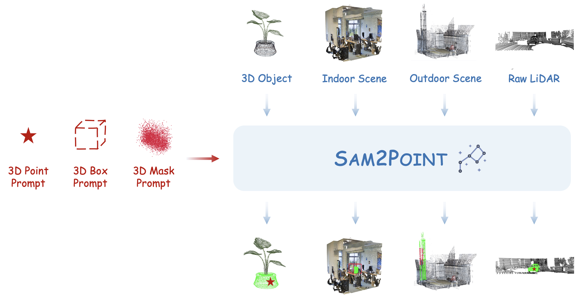

# SAM2Point 🔥: Segment Any 3D as Videos

Official repository for the project "[SAM2Point: Segment Any 3D as Videos in Zero-shot and Promptable Manners](https://github.com/ZiyuGuo99/SAM2Point/blob/main/SAM2Point.pdf)".

[[🌐 Webpage](https://sam2point.github.io/)] [[🤗 HuggingFace Demo](https://huggingface.co/spaces/ZiyuG/SAM2Point)] [[📖 arXiv Report](https://arxiv.org/pdf/2408.16768)] 

## 💥 News
- **[2024.08.30]** We release the [paper](https://arxiv.org/pdf/2408.16768), [demo](https://huggingface.co/spaces/ZiyuG/SAM2Point), and [code](https://github.com/ZiyuGuo99/SAM2Point) of SAM2Point 🚀

## 👀 About SAM2Point

We introduce **SAM2Point**, a preliminary exploration adapting Segment Anything Model 2 (SAM 2) for zero-shot and promptable 3D segmentation. Our framework supports various prompt types, including ***3D points, boxes, and masks***, and can generalize across diverse scenarios, such as ***3D objects, indoor scenes, outdoor scenes, and raw LiDAR***.

<p align="center">
     <br>
</p>

To our best knowledge, SAM2POINT presents ***the most faithful implementation of SAM in 3D***, demonstrating superior implementation efficiency, promptable flexibility, and generalization capabilities for 3D segmentation.
<p align="center">
     <br>
</p>

## 🎬 Multi-directional Videos from SAM2Point

We showcase the multi-directional videos generated during the segmentation of SAM2Point:
### 3D Object

<table>
  <tr>
    <td></td>
    <td></td>
    <td></td>
  </tr>
</table>

### 3D Indoor Scene

<table>
  <tr>
    <td></td>
    <td></td>
    <td></td>
  </tr>
</table>

### 3D Outdoor Scene

<table>
  <tr>
    <td></td>
    <td></td>
    <td></td>
  </tr>
</table>

### 3D Raw LiDAR

<table>
  <tr>
    <td></td>
    <td></td>
    <td></td>
  </tr>
</table>

## 💪 Get Started
### Installation

Clone the repository:

   ```bash
   git clone https://github.com/ZiyuGuo99/SAM2Point.git
   cd SAM2Point
   ```

Create a conda environment:

   ```bash
   conda create -n sam2point python=3.10
   conda activate sam2point
   ```
   SAM2Point requires Python >= 3.10, PyTorch >= 2.3.1, and TorchVision >= 0.18.1. Please follow the instructions [here](https://pytorch.org/get-started/locally/) to install both PyTorch and TorchVision dependencies.

   Install additional dependencies:
   ```bash
   pip install -r requirements.txt
   ```

### Prepare SAM 2 and 3D Data Samples

   Download the checkpoint of SAM 2:

   ```bash
   cd checkpoints
   bash download_ckpts.sh
   cd ..
   ```

We provide 3D data samples from different datasets for testing SAM2Point:
   ```bash
   gdown --id 1hIyjBCd2lsLnP_GYw-AMkxJnvNtyxBYq
   unzip data.zip
   ```

   Alternatively, you can download the samples directly from [this link](https://drive.google.com/file/d/1hIyjBCd2lsLnP_GYw-AMkxJnvNtyxBYq/view?usp=sharing).
   
***Code for custom 3D input and prompts will be released soon.***

### Start Segmentation
Modify `DATASET`, `SAMPLE_IDX`, `PROPMT_TYPE`, `PROMPT_IDX` in `run.sh` to specify the 3D input and prompt.

Run the segmentation script:
   ```bash
   bash run.sh
   ```

   The segmentation results will be saved under `./results/`, and the corresponding multi-directional videos will be saved under `./video/`.


## :white_check_mark: Citation

If you find **SAM2Point** useful for your research or applications, please kindly cite using this BibTeX:

```latex
@article{guo2024sam2point,
  title={SAM2Point: Segment Any 3D as Videos in Zero-shot and Promptable Manners},
  author={Guo, Ziyu and Zhang, Renrui and Zhu, Xiangyang and Tong, Chengzhuo and Gao, Peng and Li, Chunyuan and Heng, Pheng-Ann},
  journal={arXiv preprint arXiv:2408.16768},
  year={2024}
}
```

## 🧠 Related Work

Explore our additional research on **3D**, **SAM**, and **Multi-modal Large Language Models**:

- **[Point-Bind & Point-LLM]** [Multi-modality 3D Understanding, Generation, and Instruction Following](https://github.com/ZiyuGuo99/Point-Bind_Point-LLM)
- **[Personalized SAM]** [Personalize Segment Anything Model with One Shot](https://github.com/ZrrSkywalker/Personalize-SAM)
- **[Point-NN & Point-PN]** [Starting from Non-Parametric Networks for 3D Analysis](https://github.com/ZrrSkywalker/Point-NN)
- **[PointCLIP]** [3D Point Cloud Understanding by CLIP](https://github.com/ZrrSkywalker/PointCLIP)
- **[Any2Point]** [Empowering Any-modality Large Models for 3D](https://github.com/Ivan-Tang-3D/Any2Point)
- **[LLaVA-OneVision]** [Latest Generations of LLaVA Model](https://llava-vl.github.io/blog/2024-08-05-llava-onevision/)
- **[LLaMA-Adapter]** [LLaMA-Adapter: Efficient Fine-tuning of Language Models with Zero-init Attention](https://github.com/OpenGVLab/LLaMA-Adapter)
- **[MathVerse]** [MathVerse: Does Your Multi-modal LLM Truly See the Diagrams in Visual Math Problems?](https://mathverse-cuhk.github.io/)
